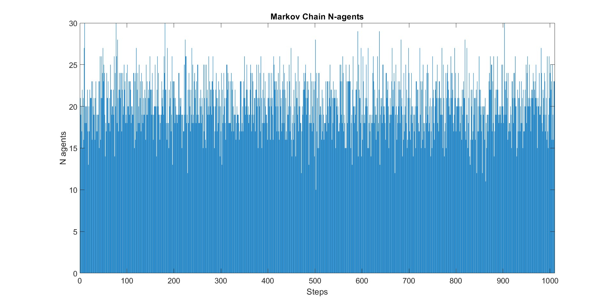

# markovchain-matlab
**Matlab example of Markov Chain with N agents**

In this simple example a Markov Chain is implemented considering N agents. 
The length of the simulation is set along with the number of agents that come into play. 
The agent in this example refers to the number of people in the zone. 
This code enable the stochastic simulation of the occupancy into a specific zone based on the probabilities set into the transitional matrix. 
The transitional matrix can be further extended in order to embed the real transition probabilities at each step (at the moment we are using proxy values).

